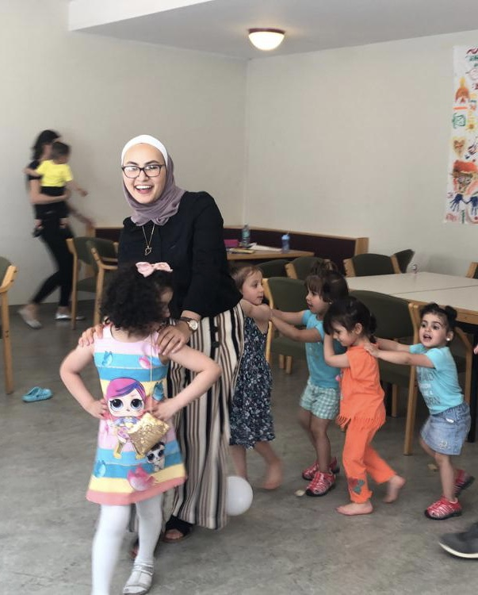
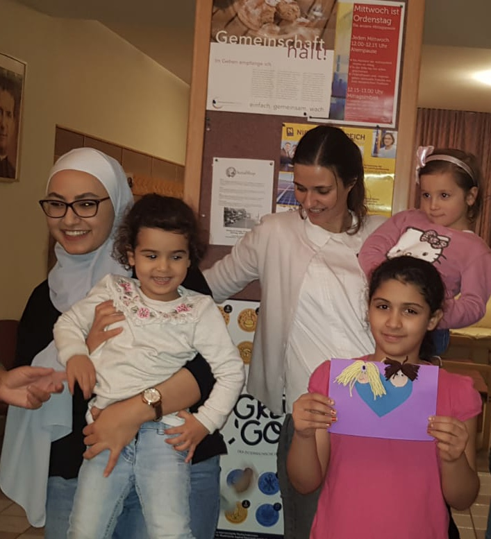

Ich mag keine Deutschkurse, wo LehrerInnen vor der Tafel unterrichten und die TeilnehmerInnen alle nur zuhören, so wie in der Schule. Es gibt heutzutage viele Möglichkeiten die Theorie auch zu Hause zu lernen. Ich liebe einen Ort, an dem man sein Wissen praktisch umsetzen kann, wo man frei sprechen und seine Meinung laut sagen kann. Don Bosco für Flüchtlinge bietet das in einer sehr familiären Atmosphäre an.

Mein Name ist Sajeda und ich komme aus Syrien. Alles begann im Jahr 2017, als ein Freund meiner Schwester, Abdullah, ihr von diesem Kurs erzählte. Meine Schwester hatte keine Lust, aber ich schon. Eigentlich wollte ich nur schauen ob der Kurs genauso langweilig ist, wie die anderen Kurse, aber nein, ich habe sehr nette und unterschiedliche Leute kennengelernt. Ich konnte auch ein paar gute Freunde gewinnen, mit denen ich noch Kontakt habe (Rita steht ganz oben auf der Liste 😉).

Und das war nicht alles. Im Oktober 2017 wurde ein Mutter-Kind-Kurs gebildet, den ich selbst sehr hilfreich fand, besonders für Mütter, die schüchtern sind und auch nicht mutig genug, alleine Deutsch zu lernen. Ich habe bei der Kinderbetreuung geholfen und auch manchmal für die neuen Mamas übersetzt. Wir haben immer eine gute Zeit mit den Kindern gehabt, es war wie eine Therapie nach einem langen Tag. Wir haben zusammen viel getanzt, gebastelt, gegessen und Deutsch gelernt.

Bei Don Bosco für Flüchtlinge gibt es viele unterschiedlichen Aktivitäten und immer etwas neues zu erzählen.

